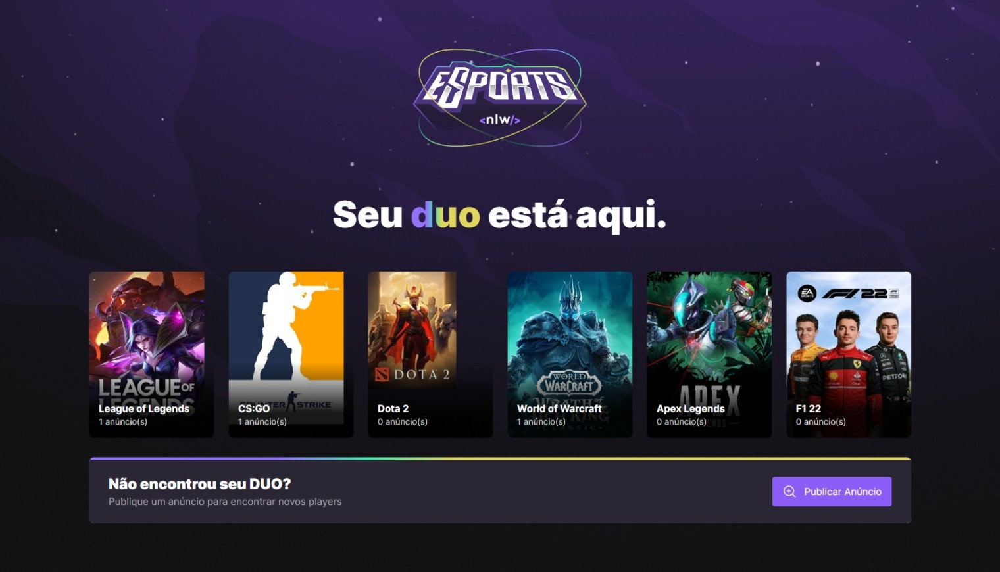
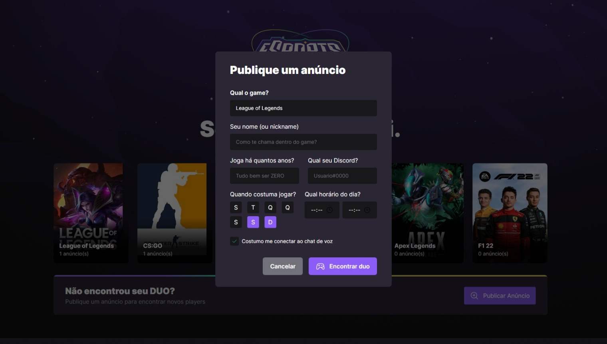
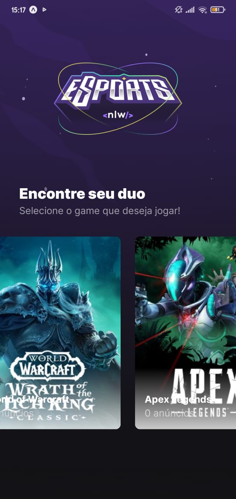
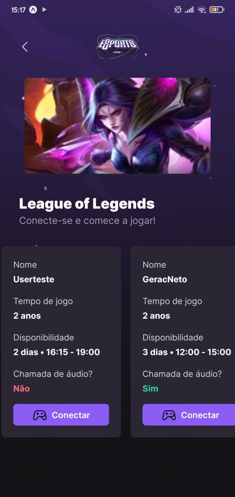
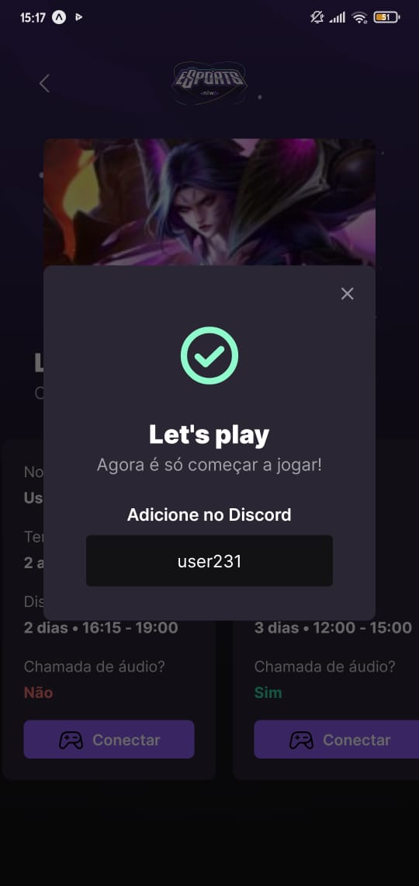
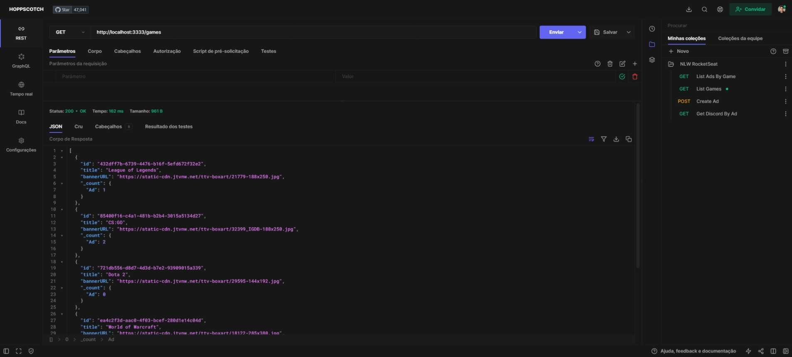
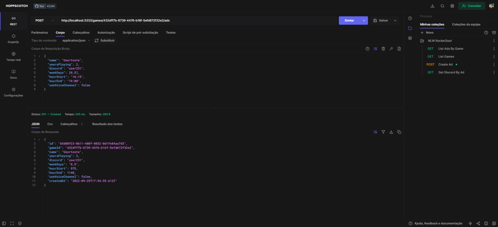
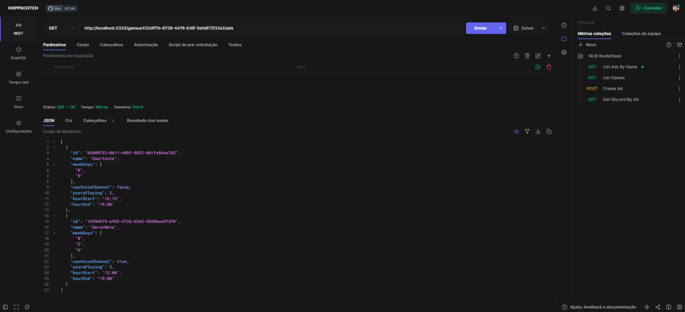
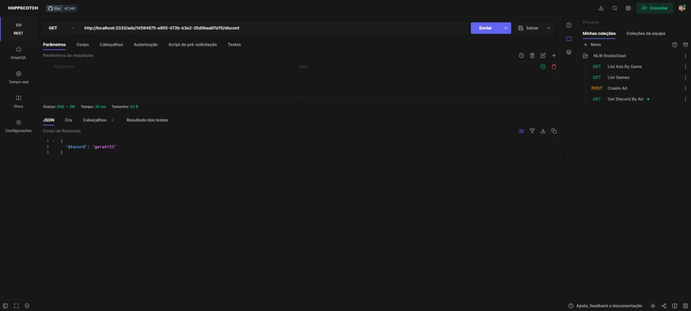

# NLW eSports RocketSeat

## Projeto desenvolvido durante a semana de nlw da <a href="https://www.rocketseat.com.br/discover"><i>RocketSeat</i></a>

### A aplicação tem como objetivo encontrar e se conectar com jogadores para partidas online por meio do <a href="https://discord.com/"><i>Discord</i></a>. 

### Para esse projeto foi dessenvolvida a API para publicação dos anúncios pelos usuários, uma interfcae WEB para fazer essas publicações, e uma mobile onde outros jogadores podem encontrar essas postagens e se conectar com os demais competidores

### Muitas tecnologias e bibliotecas foram utilizads no desenvolviemtno desse projeto fullstack, dentre eles:
- React.js
- React Native
- Node.js
- Prisma
- Tailwindcss
- Typescript
- Express
- Expo Go
- Phophor-react
- Radix

<div align="center" style="display: inline_block"><br>
  
  
  
  
  
  
  
  
</div>
<br>

### - O backend da aplicação foi desenvolvido com o **Express**. Nele foi criada a API com as rotas para a comuniação com o frontend.

### - A interface **WEB** foi desenvolvida utilizando o **React.js** onde os usuários podem publicar o jogo, horário disponível para jogar, dias da semana e o seu Discord.

### - O app **MOBILE** foi desenvolvido utilizando o **React Native**. Nele é feita comunicação com a API onde os jogadores podem visualizar os anúncios dos demais players e se conectarem pelo Discord.

<hr>

# Web


## Home



## Modal - Criara Anúncio



# Mobile


## Home



## Ads



## Modal - Conectar com Player



# Server API Routes

## GET /games



## POST /games/:id/ads



## GET /games/:id/ads



## GET /ads/:id/discord



<hr>

## Install
Entre nas pastas e rode o comando abaixo para instalar as dependências dos projetos
- /server
- /mobile
- /web
```sh
$ npm install
```
## Running
Antes de rodar a a aplicação, incie o servidor. Para isso, entre na pasta */server* e rode o comando abaixo:
```sh
$ npm run dev
```
- Para rodar a aplicação **WEB** entre na pasta /web e rode o comando abaixo:
```sh
$ npm run dev
```
- Para rodar a aplicação **MOBILE** entre na pasta /mobile e rode o comando abaixo:
```sh
$ npm start
```
Feito isso, instale o app **Expo Go** no seu celular e escanei o QR code gerado para ecessar o aplicativo


